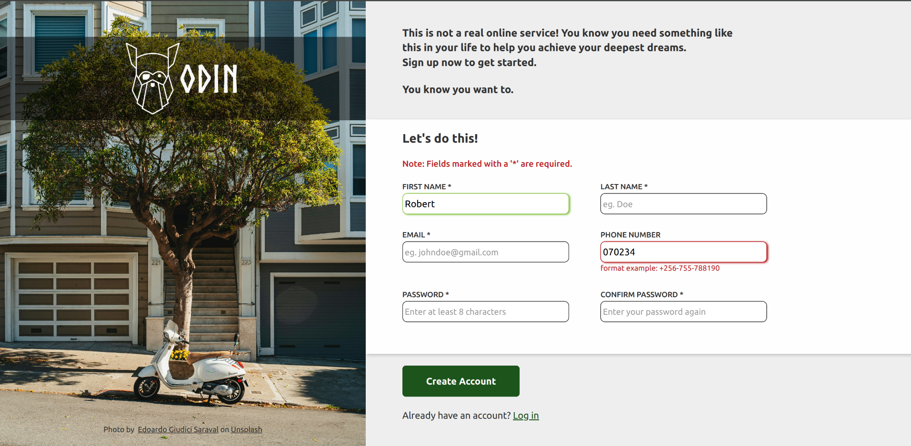

<h1 align=center>Sign up form</h1>

Built with ❤️

## Preview

> _More pages coming soon..._

A simple sign-up form built using HTML and CSS. This project is part of the [Intermediate HTML and CSS Course](https://www.theodinproject.com/lessons/node-path-intermediate-html-and-css-sign-up-form) challenge on The Odin Project.

## Technologies used
-    
- 

## About the project
The form page includes the most commonly used input field types such as text, email and telephone. It is designed for desktop and ipad screen sizes and it renders well on most of the popular browsers such as google chrome and firefox.

## Project goals
The aim for doing this project was to practice my HTML and CSS skills learnt such as creating page layouts using flexbox and styling for form validation using pseudo-classes.

## Acknowledgements
- [The Odin Project](https://www.theodinproject.com/) for the course and project
- [MDN Web Docs](https://developer.mozilla.org/en-US/) for documentation on HTML and CSS
- [CSS Tricks](https://css-tricks.com/) for tips on CSS styling